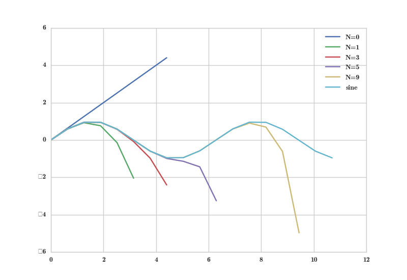

Vorlesung und &Uuml;bungen zur Funktionentheorie - OvGU - 2017
-----

> :rocket: Es gibt Pr&uuml;fungstermine: 05., 15. und 28. M&auml;rz und 09. April. Wer es nicht schafft, sich in *die* Liste einzutragen, der meldet sich per Email.

Hier gibt's die grundlegenden und aktuelle Informationen zur Vorlesung *Funktionentheorie* and der OvGU im Wintersemester 2017. Verantwortlich sind [Jan Heiland](http://www.mpi-magdeburg.mpg.de/person/29457/822630) and [Steffen Werner](http://www.mpi-magdeburg.mpg.de/person/38514/822672).

| Tag | Zeit | Ort |
| ------- | ------ | ------- |
| Dienstag | 11:00-13:00 | G22A-119 |
| Donnerstag | 11:00-13:00 | G12-201 |

:memo: Zu den [&Uuml;bungen](#uebungen).

<h3 id="overview">&Uuml;bersicht &uuml;ber die Vorlesung</h3>
 0. Historische Einf&uuml;hrung und grundlegende Konzepte [[Woche 1]](#woche-1)
   * Historischer Abriss und Anwendungen
   * [Literatur](#literatur)
 1. Grundlagen
   * Einf&uuml;hrung in die komplexen Zahlen
   * Rechnen mit komplexen Zahlen
   * Polardarstellung [[Woche 2]](#woche-2)
   * (konvergente) Reihen komplexer Zahlen
   * Sinus, Cosinus, Exponentialfunktion [[Woche 4]](#woche-4)
 2. Differentiation im Komplexen
   * Holomorphe Funktionen [[Woche 5]](#woche-5)
   * Cauchy-Riemann'sche Differentialgleichungen [[Woche 6]](#woche-6)
   * Strecken- und Winkeltreue holomorpher Funktionen
   * Lokale Invertierbarkeit [[Woche 7]](#woche-7)
 3. Integration im Komplexen [[Woche 8]](#woche-8)
   * Kurven und Kurvenintegrale
   * Stammfunktionen [[Woche 9]](#woche-9)
   * Wegunabh&auml;ngigkeit
   * Cauchy's Integralsatz [[Woche 10]](#woche-10)

<h3 id='uebungen'>&Uuml;bungen</h3>

| Date | Topic | Sheet |
| ------- | ------ | ------- |
| [26. Oktober](#exercisei) | I - Komplexe Zahlen | [blatt_01.pdf](files/blatt_01.pdf) |
| [09. November](#exerciseii) | II - Potenzreihen und `Sin/Cos/Exp` | [blatt_02.pdf](files/blatt_02.pdf) |
| [23. November](#exerciseiii) | III - Stetigkeit und Differenzierbarkeit | [blatt_03.pdf](files/blatt_03.pdf) |
| [7. Dezember](#exerciseiv) | IV - Integration im Komplexen | [blatt_04.pdf](files/blatt_04.pdf) |
| [14. Dezember](#exercisev) | V - Stammfunktionen  | [blatt_05.pdf](files/blatt_05.pdf) |
| [18. Januar](#exercisevi) | VI - Integrale und Singularit&auml;ten  | [blatt_06.pdf](files/blatt_06.pdf) |
| [25. Januar](#exercisevii) | VII - Definitionen und Beispiele  | [nur online](#exercisevii) |

### Woche 1

#### Einf&uuml;hrung

+++ Entdeckung/Entwicklung und Formalisierung der komplexen Zahlen +++ Mathematische Definition +++ Rechnen mit komplexen Zahlen +++ [zur&uuml;ck zur &Uuml;bersicht](#overview)

### Woche 2

+++ Polardarstellung +++ Potenzieren und Wurzel ziehen +++ (konvergente) Potenzreihen +++ [zur&uuml;ck zur &Uuml;bersicht](#overview)

### Woche 3

<h4 id="exercisei"> &Uuml;bungsblatt 1 -- 26. Oktober </h4>
+++ Rechnen mit komplexen Zahlen +++ Wurzeln ziehen +++ Betragsungleichungen +++ [zur&uuml;ck zur &Uuml;bersicht](#overview)

### Woche 4
+++ Sinus, Cosinus und die Exponentialfunktion als Potenzreihen +++ Additionstheoreme +++ Approximation durch abgeschnittene Potenzreihen +++ :chart_with_upwards_trend: [Illustration](files/truncatedsines.html) -- :floppy_disk: [pythoncode](files/sinus-series-test.py)  +++ Stetigkeit und Darstellung komplexer Funktionen +++ [zur&uuml;ck zur &Uuml;bersicht](#overview)

### Woche 5
+++ Stetigkeit von Verk&uuml;pfungen +++ Differenzierbarkeit und holomorphe Funktionen +++ Rechenregeln zur Ableitung +++ "holomorphe Funktionen sind beliebig oft differenzierbar" +++ [zur&uuml;ck zur &Uuml;bersicht](#overview)

<h4 id="exerciseii"> &Uuml;bungsblatt 2 -- 09. November </h4>
+++ Potenzreihen +++ Exp/Sin/Cos +++ Exponentialgesetze und Additionstheoreme+++ [zur&uuml;ck zur &Uuml;bersicht](#overview) 

### Woche 6
+++ Ableitung als Linearisierung +++ Herleitung der Cauchy-Riemann'schen Differentialgleichungen +++ Folgerungen aus den Cauchy-Riemann'schen Differentialgleichungen +++ [zur&uuml;ck zur &Uuml;bersicht](#overview)

### Woche 7
+++ Strecken- und Winkeltreue holomorpher Funktionen +++ Invertierbarkeit +++  [zur&uuml;ck zur &Uuml;bersicht](#overview)

<h4 id="exerciseiii"> &Uuml;bungsblatt 3 -- 23. November </h4>
+++ Komplexe Differenzierbarkeit +++ Cauchy-Riemann'sche Differentialgleichungen +++ Ableitung von Potenzreihen +++ [zur&uuml;ck zur &Uuml;bersicht](#overview)

### Woche 8
+++ Kurven in der komplexen Ebene +++ Parametrisierung und (st&uuml;ckweise Glattheit) +++ Integration entlang von Kurven +++ Bogenl&auml;nge +++ [zur&uuml;ck zur &Uuml;bersicht](#overview)

### Woche 9
+++ Stammfunktionen +++ Integral &uuml;ber geschlossene Kurven +++ Wegunabh&auml;ngigkeit +++ [zur&uuml;ck zur &Uuml;bersicht](#overview)

<h4 id="exerciseiv"> &Uuml;bungsblatt 4 -- 7. Dezember </h4>
+++ Integal von Funktionen l&auml;ngs von Kurven +++ Parametrisierungsinvarianz ++ [zur&uuml;ck zur &Uuml;bersicht](#overview)+

### Woche 10
+++ Konvexe- und Sterngebiete +++ Cauchys Integralsatz +++ Cauchys Integralformel +++  [zur&uuml;ck zur &Uuml;bersicht](#overview)

<h4 id="exercisev"> &Uuml;bungsblatt 5 -- 14. Dezember </h4>
+++ Kettenregel +++ Stammfunktionen +++ Wegunabh&auml;ngigkeit gdw. verschwindendes Integral &uuml;ber geschlossene Kurven +++ [zur&uuml;ck zur &Uuml;bersicht](#overview)

### Woche 11
+++ Folgerungen aus Cauchys Integralformel +++ Leibnizsche Regel +++ verallgemeinerte Integralformel Cauchys +++ [zur&uuml;ck zur &Uuml;bersicht](#overview) 

+++ ganze Funktionen +++ Fundamentalsatz der Algebra +++ [zur&uuml;ck zur &Uuml;bersicht](#overview)

### Woche 12
+++ analytische Funktionen +++ gleichm&auml;&szlig;ige Approximation +++ Potenzreihen revisited +++ [zur&uuml;ck zur &Uuml;bersicht](#overview)

### Woche 13
+++ Charakterisierung von isolierten Singularit&auml;ten +++ Laurent-Reihen +++ [zur&uuml;ck zur &Uuml;bersicht](#overview)

<h4 id="exercisevi"> &Uuml;bungsblatt 6 -- 18. Januar </h4>
+++ Integral mit Singularit&auml;ten +++ Potenzreihenentwicklung +++ Singularit&auml;ten +++ [zur&uuml;ck zur &Uuml;bersicht](#overview)

### Woche 14
+++ Laurent-Reihen +++ Residuen +++ [zur&uuml;ck zur &Uuml;bersicht](#overview)

<h4 id="exercisevii"> &Uuml;bung 7 -- 25. Januar </h4>
Man trage eine der folgenden Definitionen frei vor und erl&auml;utere sie mit Hilfe einer Illustration oder einem Beispiel.

 * 1.1  	imaginaere Einheit, komplexe Zahl, Gleichheit, Menge CC, Komplexe Ebene
 * 			Konvergente Folge und Reihe
 * 			Konvergenzbereich
 * 			Exponentialfunktion, Sinus/Kosinus
 * 1.8 		Stetigkeit von Funktionen 
 * 2.1 		Komplex differenzierbar
 * 2.1.1 	Holomorphe Funktion
 * (2.6) 	Cauchy-Riemann Differentialgleichungen
 * 3.1 		Kurve ((stckw.) glatt)
 * 3.2 		Kurvenintegral
 * 3.3 		Stammfunktion
 * (3.6 	Gebiet)
 * 3.17 	ganze Funktion
 * (4.1 	glm. Konvergenz)
 * (4.6 	glm. Konvergenz bei Funktionenreihen)
 * 5.1 		punktierte Kreisscheibe
 * 5.2 		isolierte Singularitaet (hebbar, Pol, wesentlich)
 * 5.7 		Laurent-Reihe (Hauptteil, Regulaerteil)
 * 			Konvergenzbereich der Laurent-Reihe
 * 5.11 	Residuum

### Literatur

| Author | Titel | Kommentar |
| ------- | ------ | ------- |
| Herz, Andreas | Repetitorium Funktionentheorie | enth&auml;lt alle Inhalte der Vorlesung -- wenig Flie&szlig;text ++ viele Beispiele und durchgerechnete &Uuml;bungsaufgaben |
| J&auml;nich, Klaus | Funktionentheorie: eine Einf&uuml;hrung | viel Text und viele Erkl&auml;rungen ++ setzt Kenntnisse der komplexen Zahlen und der Differentialrechnung im Reellen voraus |
